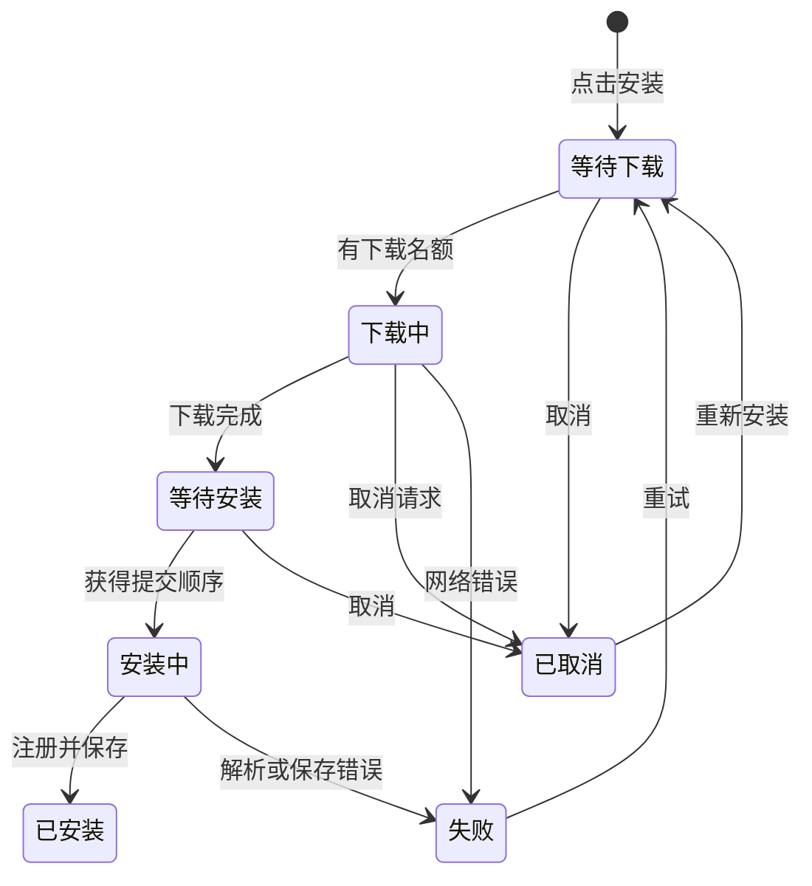

# 漫画源安装任务交互设计

## 目标与当前问题

用户需要连续安装多个漫画源，点完一个源后可以立即继续浏览、搜索和点击下一个。
目前安装会打开全局进度弹窗，仓库页面还使用一个 busyUrl 禁用所有条目，安装操作和页面生命周期也耦合。

本轮沿用已有“已安装／源仓库”、仓库目录与 Material 样式，优化安装这一条流程。

## 界面与状态

| 状态 | 漫画源条目 | 可用操作 |
| --- | --- | --- |
| 未安装 | 安装漫画源 | 点击立即创建任务 |
| 排队 | 等待下载 | 取消；其他源照常可点 |
| 下载 | 圆形进度；有总字节数时显示真实百分比，否则旋转指示 | 右侧 × 取消；可继续搜索、刷新、安装其他源 |
| 已下载 | 等待安装 | 取消 |
| 写入与注册 | 安装中 | 短暂禁用本任务的取消，保证提交完整 |
| 完成 | 已安装及来源 | 使用现有来源管理操作 |
| 失败 | 安装失败 | 重试；详情入口可看原因摘要和完整原因 |
| 取消 | 已取消 | 重新安装 |

管理页标签栏下显示轻量任务入口：“安装任务 · 进行中 N · 失败 M”，没有任务时隐藏。仓库目录标题栏始终保留安装任务图标，并以角标显示进行中数量（没有进行中任务时显示失败数量），首次安装和清理任务都不会插入或移除列表上方的内容。
点击入口打开任务列表，每个任务显示名称、来源、状态与适用操作；可清理已结束的记录。下载百分比只代表下载阶段，不伪造安装百分比。

目录条目的名称、版本和描述保持原有布局，底部状态与操作使用固定高度，随系统字号适配但不随任务状态变化。安装按钮、圆环与 ×、重试和已安装标识共用右侧固定宽度的操作区。状态和来源单行省略，悬停或长按可查看完整提示；失败原因在任务详情中展开，避免撑高目录条目。写入与注册期间保留 × 的位置并禁用取消。

完成和失败不弹出阻塞框、不抢焦点、不改变列表滚动位置。完成记录保留到用户清理或退出应用，避免瞬间消失让用户找不到结果。

## 任务规则

1. 点击即入队。应用级管理器持有任务；关闭目录、切换仓库、离开漫画源页后继续运行，返回时仍能查看。
2. 最多 3 个任务同时下载；写入、解析、注册脚本按顺序完成，并与源更新、重载协调，避免共享 JavaScript 运行时和本地文件竞争。
3. 以 sourceKey 优先去重，未知 key 的手动链接按 URL 去重。跨仓库的同一个源正在安装时，其他条目显示已有任务与来源，不创建第二个任务。
4. 仓库安装、链接安装、文件导入使用同一任务模型。链接表单只负责收集地址，提交后关闭并入队。
5. 排队和下载任务可以取消；下载取消会中断网络请求。安装提交开始后完成本次提交，避免留下半安装状态。
6. 一个任务失败不影响其余任务。失败保留中文摘要和可展开的完整原因，可单独重试；取消任务也可重新安装。正在进行的任务跨仓库共享，终态记录仅在原仓库原地址的条目内显示，其他仓库可以重新发起安装。
7. 安装前重新确认仓库仍存在且地址未改变。来源已改变时要求重新从仓库发起，不悄悄改用另一个来源。
8. 完成后同时注册已安装源、来源和搜索／发现等入口。页面刷新依靠状态通知，不做整个应用导航树的强制重建。
9. 本轮任务属于当前应用会话；离开页面继续执行，退出应用不保存未完成队列，也不宣称手机后台服务或重启续传。已完成安装持久保存。

## 验收

不编写测试。进行格式、静态分析、结构检查、macOS 构建，并使用独立预览副本和自建慢速示例目录人工核对：连续点击多个源、下载进度、排队、取消、失败重试、离开后继续、同 key 去重、完成后入口与来源保存。记录未覆盖的平台和系统后台限制。

## 本轮实现与验证记录（2026-09-13）

- 实现应用会话级任务队列、最多 3 路下载、串行脚本提交、真实下载进度、逐项取消／重试、跨仓库去重和共用任务入口。
- 安装失败只清理本次新增脚本和注册对象，不重载所有漫画源。更新、重载、卸载与安装提交使用同一个串行入口。
- 原生 macOS 独立预览中连续点击 4 个源，确认 3 个下载、1 个等待；取消其中一个下载后，等待任务立即开始，服务端确认连接中断。
- 实际核对网络失败后恢复重试、取消后重新安装、离开漫画源页面后仍能完成、重启后已安装源及来源保留。
- 切到镜像仓库时，正在进行的源显示原仓库任务；已取消的源可以从镜像仓库重新安装，完成来源记录指向镜像仓库。
- 链接安装提交后表单立即关闭；无效脚本在任务中显示中文失败摘要和详情入口，不影响其他已安装源；失败脚本文件已清理。
- 清理已结束任务后列表显示空状态、管理页任务入口收起，已安装源继续保留。
- 最终预览包含 9 个自建示例源。未下载或验证第三方漫画源。
- 格式、静态分析（无错误／警告，24 条既有 info）、结构边界检查和 macOS debug 构建通过。按本轮要求没有编写测试。
- 尚未进行 Android／iOS 真机验证；文件导入共用队列已通过静态检查，未人工覆盖文件选择器；安装提交阶段很短，等待提交期间的取消与更新并发仅经过代码复核。

## 固定条目布局验证（2026-09-14）

- 目录状态栏保持固定高度，操作统一靠右；下载使用圆形进度与 × 取消，失败只保留状态、详情入口和重试。
- 目录任务入口移到标题栏，首次创建任务不再向列表上方插入内容。
- 使用独立 macOS 预览副本和已有本地慢速示例源，人工核对首次安装、连续安装、排队、取消、安装完成、失败和详情入口。相邻条目的按钮与分隔线位置保持不变。
- 修正新版 Flutter 对进度读屏值的要求：数值由进度组件生成，状态文字放入读屏标签。重新编译预览后，下载与取消的辅助功能信息能正常更新，日志中未再出现进度语义断言或布局溢出。取消已生效，但底层 rhttp／flutter_rust_bridge 仍记录 `STREAM_CANCEL_ERROR`；本轮未修改网络层。
- 两个改动的 Dart 文件静态分析无问题，格式与 `git diff --check` 通过。macOS 调试 Flutter 资源编译通过，并在独立预览应用中验证；没有重新构建完整原生宿主，也没有替换正式安装的应用。
- 未编写测试；本轮未验证 Android／iOS 真机或系统大字号显示。
