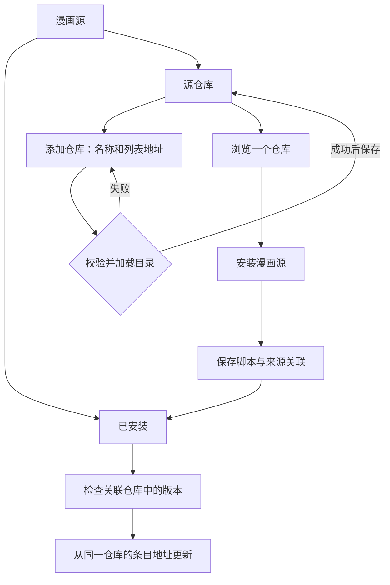

# 漫画源与源仓库管理设计

## 目标与依据

让用户能明确回答：已经安装了哪些源、还能从哪里安装、每个源从哪里更新。
本设计基于现有 macOS 界面实查和 Flutter 实现；手机与平板沿用同一信息结构及应用现有 Material 组件。

现状问题：已安装列表与仓库目录同名；单个脚本 URL 与目录 URL 混淆；只保存一个仓库地址；关闭弹窗才保存；更新检查与下载使用不同依据。

## 信息架构与界面规格

“漫画源”页面保留原有导航入口，标题下增加固定的“已安装”和“源仓库”标签。

| 页面 | 内容顺序 | 主要操作 |
| --- | --- | --- |
| 已安装 | 更新检查与手动安装入口 → 来源说明 → 各源名称、版本、来源及原有设置 | 检查更新、通过链接安装、从文件导入；每个源可管理来源、编辑脚本、更新和卸载 |
| 源仓库 | 简短说明与添加仓库 → 仓库名称、目录地址、关联源数量 | 浏览源；菜单中编辑、移除 |
| 仓库详情 | 仓库名称、目录地址 → 刷新列表 → 可安装条目 | 安装；已安装显示文字状态；来源不同则提供关联操作 |
| 添加／编辑仓库 | 名称 → 列表地址 → 就地错误信息 → 取消、保存 | 保存时校验 URL、重复地址与目录格式；失败保留输入，不覆盖原记录 |
| 管理来源 | 当前来源 → 已保存仓库 → 选择仓库并确认 | 获取目标目录，检查相同 sourceKey，确认后仅修改更新来源，下一次更新才替换脚本 |

布局复用现有 Appbar、AppTabBar、列表、对话框、颜色与图标。页边距 16，操作使用 Wrap 在窄屏自动换行；长名称及地址允许换行或省略并能查看完整值。每个源的次要操作收进菜单，避免挤压手机上的名称与版本。源设置默认收起，点击展开后呈现原有设置和账号入口。桌面详情使用现有弹层，窄屏采用现有全屏弹层行为。

## 行为规则

1. 可保存多个仓库，无人为数量限制。仓库有稳定 ID、用户名称、完整 HTTP(S) 目录地址；重复地址不可再次添加。
2. 编辑操作有明确保存和取消；点击背景或返回不保存。刷新仅重新获取已保存仓库的目录。安装地址始终从当前仓库解析，支持完整 URL 和相对路径。
3. 以 sourceKey 判定源身份。同一个源不重复安装；其他仓库提供相同 key 时标明当前来源，切换来源必须主动确认。
4. 从仓库安装的源，版本检查与脚本下载都使用该仓库的条目。目录移除该 key 时明确报错，不静默切换到其他仓库。
5. 从链接或文件手动安装的源显示具体来源类型，可关联仓库。没有关联仓库时不参加目录版本检查，仍可通过源脚本声明的更新地址手动更新。
6. 批量检查独立处理各仓库；部分仓库失败时保留其他仓库的结果，明确显示失败仓库与未检查源数量，不能把失败说成“没有更新”。过期更新提示在新检查、变更来源和成功更新时清除。
7. 移除仓库前说明关联源数量；只删除仓库记录，保留漫画源、源设置和阅读数据。已安装源显示“仓库已移除”，可以重新关联；卸载漫画源是独立操作。
8. 加载中禁用重复操作；空仓库、无仓库、无已安装源、目录失败和安装失败各有可继续操作的状态。异步完成时检查页面是否仍存在。

## 持久化与迁移

- `appdata.json/settings/comicSourceRepositories`：仓库记录数组（id、name、url）。
- `appdata.json/settings/comicSourceOrigins`：sourceKey 到安装来源的映射（kind、repositoryId、repositoryName、url）。
- `comicSourceRepositoriesMigrated`：一次性迁移标志；原 `comicSourceListUrl` 迁移成一条仓库，保留旧值供旧版本读取。删除全部仓库后不再自动恢复旧地址。
- 不推断旧源的来源，显示“未关联仓库”，用户可主动关联。已安装 `.js`、源 `.data` 和阅读数据保持原有结构。
- 仓库记录与来源关联随已有 appdata 备份／同步机制保存，不引入另一套同步服务。目录内容仅作为当前加载结果使用。

## 验收方式

遵照项目要求不编写测试。通过 Dart 格式检查、静态分析、项目结构检查、macOS 构建及原生界面手动检查验证。重点查看双标签、编辑取消／错误、空态、长文本和真实目录加载；记录无法在本机验证的平板行为，不将编译成功等同于平板体验通过。

## 实现与人工核对记录（2026-09-12）

设计已落实到 Flutter 应用。仓库数据和目录加载在 `source_repositories.dart`，仓库列表、编辑、浏览及关联界面在 `source_repository_page.dart`，原管理页保留源设置、账号和脚本管理能力。

使用独立包标识的 macOS 预览副本和本机自建示例目录核对，未使用用户正式应用的数据，也未安装第三方漫画源：

- 已安装／仓库两个空态正确，添加两个仓库后均可见，地址分别保存。
- 缺少或无效地址显示就地错误；取消修改后仓库名称保持不变。
- 从 B 的相对脚本路径安装后，目录显示“已安装 · B”和“已关联此仓库”。
- 在 A 浏览同一个 key 时显示“使用此仓库”；确认后切换来源，没有重复安装。
- 原脚本版本 1.0.0、原更新地址为 B；关联 A 后查到 A 的 1.1.0，并从 A 成功更新到 1.1.0。
- 移除 A 后脚本与 1.1.0 版本保留，来源显示“仓库已移除”。
- 重启读取旧格式的示例数据，单 URL 迁移为一个仓库，已有脚本保留并显示“未关联仓库”。检查结果明确显示“已检查 0 个 · 未检查 1 个”。
- 在约 900 × 600 与 523 × 600 的原生窗口检查列表、目录、编辑和更新弹窗，未发现溢出或按钮遮挡。修正了核对时发现的 URL 末尾多余空片段符号。

验证通过：Dart 格式检查、结构边界检查、静态分析（无错误和警告，保留既有提示项）、macOS Debug 构建。构建使用进程级 `FLUTTER_SWIFT_PACKAGE_MANAGER=false RUSTUP_TOOLCHAIN=stable RUSTUP_AUTO_INSTALL=0`，沿用 CocoaPods 和本机已安装工具链；自动生成的工程迁移改动未纳入功能。

验证边界：未运行自动化测试；未在 Android 平板真机上核对触摸、软键盘及系统文件选择器；未对第三方仓库可用性作出保证；部分仓库失败的隔离和脚本标识不匹配的拒绝路径进行了代码核对，尚未逐项通过界面复现。
